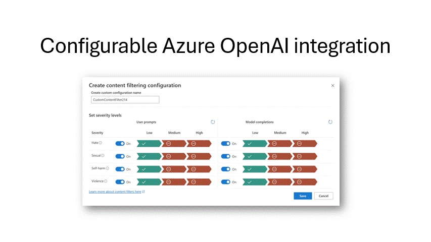
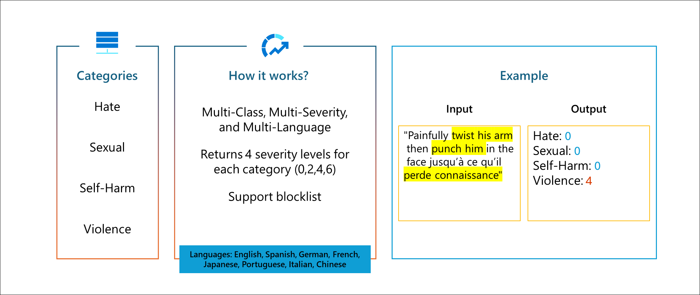
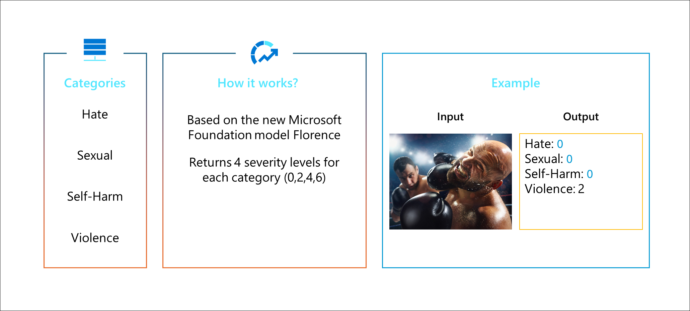

# Overview

As we build applications that engage with people, it’s vital that the content that is displayed to the end-user is not harmful or offensive.  In this workshop you will learn how to use the prebuilt AI service, Azure Safety Content, in your applications to ensure that the texts or images that are sent to the user or the user enters do not contain data that has violence, self-harm, hate or sexual information.  In addition, based on the demographic of the end-users that interact with the application, developers can control what content is acceptable based on the sensitivity level of the inappropriate content. The services support multiple languages and multiple industries such as gaming, e-commerce, social media, education, etc. 

There are several challenges in having a staff of moderators to review the content. The limitations are difficult to manually inspect the enormous amount of text or images. Another challenge is that the staff that are evaluating the text are subjective, insistent on what they classify as a violation, or it can be time consuming. Using the Content Safety AI service makes it possible to catch issues faster and more efficiently. This reduces unnecessary manual repetitive tasks and potentially errors. In addition, the API service has built-in profanity detection.
With the vast use of generative AI, there are user input prompts and dynamic AI-generated responses, Azure Content Safety serves as a useful tool to safeguard content that can be risky or undesirable.

## At the end of the workshop, you will:
-	Learn how to detect and flag text that are unsuitable for end-users.
-	Learn how to block images that are inappropriate.
-	Learn how to create applications with a safe and friendly tone. 

## Pre-requisites:
The Content Safety API can be used in different programming languages. For this lab, we’ll be using Python.
-	Basic knowledge of Python.
-	Login or sign up for a [Free Azure account](https://azure.microsoft.com/free/).
-	Install [Visual Studio Code](https://code.visualstudio.com/Download "Visual Studio Code") 

## Exercise 1: Create an instance of Azure Content Safety

1.	Click the **Create a resource** button (the plus-sign in the top left corner)
2.	Search for **content safety**, select the "Content Safety" result and click **Create**
1.	This brings you to the **Create Content Safety** blade.
2.	Click on the “Create new” link to create a **Resource Group**. In the pop-up window, enter a name for the resource group.
3.	Pick a **Region**
4.	Fill in a **Name** for the content safety.
5.	Select a **Pricing Tier**. Then select the F0 free tier.
6.	Click **Review + Creat**e. 
7.	Finally, click on **Create** to create the content safety resource.
3.	Click the **Go to resource** button, to open the content safety overview page.
4.	Select **Keys and Endpoint** under Resource Management navigation menu.
5.	Copy the Key and Endpoint to use later.

## Exercise 2: Launch Project GitHub codespaces

To expedite running the workspace and having a consistent project environment, we’ll be using GitHub codespaces.
To start, open the [GitHub repo](https://github.com/Azure-Samples/rai-content-safety-workshop) for the workshop.
1.	Open the [azure-content-safety-workshop GitHub repo](https://github.com/Azure-Samples/rai-content-safety-workshop).
2.  Click the **settings** menu.
3.  Under the **Secrets and variables**, click on the **code spaces** option.
4.  Click the edit icon for **AZURE_CONTENTSAFETY_ENDPOINT** and paste the endpoint URL for yor azure content safety service.
5.  Click on the **Update secret** button.
6.  Click the edit icon for **AZURE_CONTENTSAFETY_KEY** and paste the key for your azure content safety service.
7.  Click on the **Update secret** button.
8.  Return back to the main page of the repo by click on the **Code** menu.
9.  Click the **Code** button. 
10.	Select the **Codespace** tab.
11.	Click “” to create your workspace environment.
12.	Open the *text_content_safety.ipynb* notebook.
13.	Click on **Select Kernel** on the upper right of the notebook.
14.	Select **Python Environments** in the kernel drop-down menu.
16.	Choose the **venv (Python 3.9.18)** environment.

# Exercise 3:  Analyze Text

When dealing with text, it is either user or application generated. With Generative AI, we need to be mindful that the text to be examined is either user input prompts or AI generated responses. For example, one of the challenges of using social media or Chat applications to a demographic of high school students is that it introduces system vulnerabilities for users to enter text that have profanity, bullying, harassment, derogatory implications etc. 

Let’s explore how the Content Safety API handles text.

1.	Click **Run All** to execute the *text_content_safety.ipynb* notebook.
2.	Verify that all cells ran successfully.
3.	In cell #3, the input_text set to *“You are stupid.”*
4.	In the last cell, you’ll see that the Content Safety API found the input text to be “Hate” content with a severity of 2.
5.	Now try changing the input_text to your own text and see what the output will be.

**Note**: you can add code on how you want the application to behavior or what warning message to display, based on the severity level.

## Exercise 4:  Analyze Image

There are tons of applications and social medial sites that enable users to upload images. This opens a flood gate of opportunities for users to upload sexual derogative content, violence, or harmful content. Similar to text, it’s not realistic to rely on users to flag inappropriate content or the staff to manually see the content when it’s uploaded.  Even with manual monitors, images are subjected to each individual evaluator to determine if it is risky. 

In this lab, we will see examples of how one image is clearing inappropriately and another image can be subjective.

1.	Open the *image_content_safety.ipynb* notebook.
2. Click **Run All** to execute the notebook.
2.	Verify that all cells ran successfully.
3.	In the project explorer, navigate to the “img” folder and click on the **image1.jpg** to open it.
4.	In the last cell, you’ll see that the Content Safety API found the image of a gun and bullet to be “Violence” content with a severity of 2.
5.	Now…in cell#4, try changing image1.jpg to **image2.jpg** and see what the output will be.

**Note**: you can add code on how you want the application to behavior or what warning message to display, based on the severity level.

